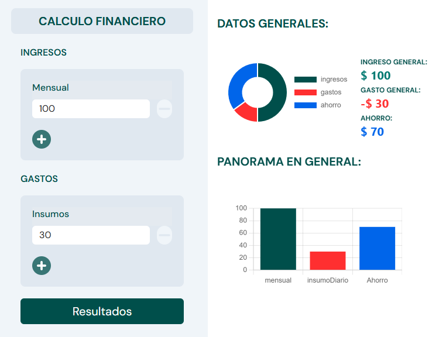

# Calculo Financiero 🚀
📌 Pagina web que tiene como finalidad mostraste los resultados o los calculos generales segun tus ingresos, gastos y mostraste el ahorro en caso te sobre o si estas en decifit. 

📌 Para este proyecto utilice los graficos de `charts.js` para mostrar los resultados.
### Link Web:
- [calculo-financiero](https://angular-mini-projects.vercel.app/calculo-financiero)
### Linkedin:
- [Post-calculo-financiero](https://www.linkedin.com/feed/update/urn:li:activity:7216956512726859776/)

## Project View

 

Finalizado: `10-07-2024`