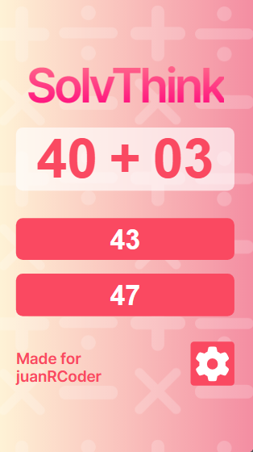

## SolvThink: Resuelve/Piensa rapido

Es un juego de pensamiento rapido, el cual el usuario podra resolver operaciones basicas como sumar, restar, multiplicar y dividir.

### 📌 Proposito:

Lo principal es ayudar al usuario a resolver operaciones matematicas rapidas el cual tiene que resolver al comprar un producto, sacar una cuenta de restaurant, entre otras cosas.

WebSite: [https://solvthink.netlify.app](https://solvthink.netlify.app/)

## 🛠 Tecnologías:
Este proyecto fue realizado con las siguientes tecnologias y dependencias: 
 
 

## 📱💻 Diseño responsivo (mobile & tablet):

- Estos son los diferentes vistas para cualquier dispositivo.

   
   

