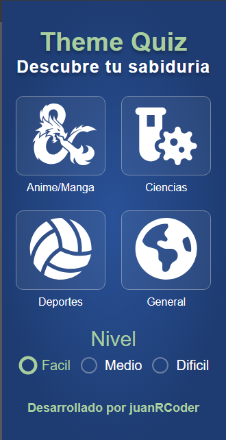

## Theme-Quizz: Pon a prueba tu sabiduria

Desafía tu conocimiento con una aplicación que presenta una serie de preguntas divididas por dificultad y cuatro categorías principales (¡pronto añadiremos más!). Adivina las respuestas correctas y aprende algo nuevo cada día resolviendo este breve quiz.

WebSite: [https://angular-mini-projects.vercel.app/theme-quizz](https://angular-mini-projects.vercel.app/theme-quizz)

## 🛠 Tecnologías:
Este proyecto fue realizado con las siguientes tecnologias y dependencias:

 
 
 

## 📱💻 Diseño responsivo (mobile & tablet):

- Estos son los diferentes vistas para cualquier dispositivo.

   
   

## API TRIVIA (categoria anime):
- https://opentdb.com/api.php?amount=21&category=31&difficulty=easy
